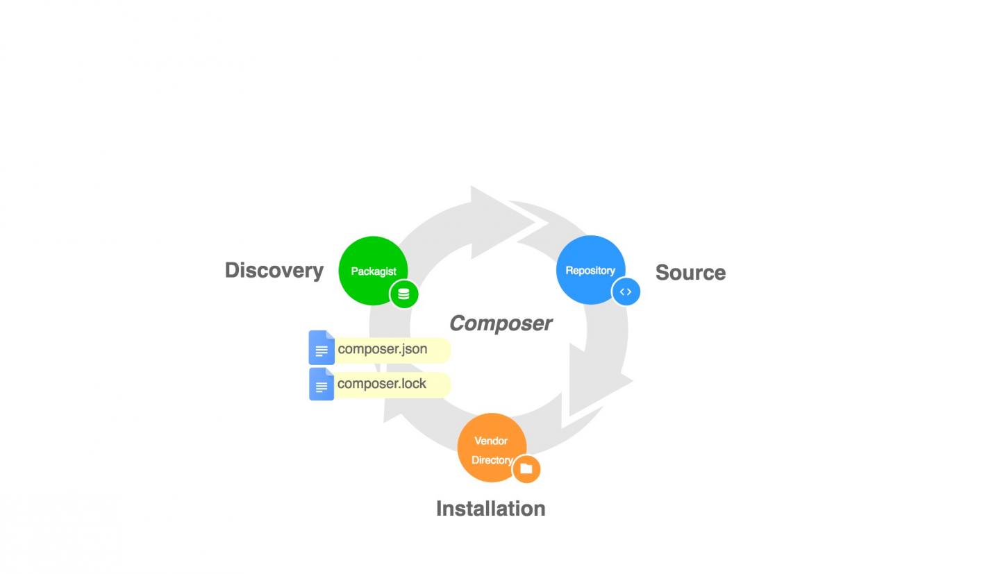

## Composer基础使用

### Composer 的工作原理
我们在使用 Composer 之前我们得了解一下它的实现原理，它主要由三个部分组成：命令行工具、包仓库、代码库：

### Packagist
它是官方仓库，也就是我们平常说的 Composer 源，它的作用是存储这些包的信息，版本，代码来源，依赖，作者，主页等信息。官网是 packagist.org/, 你也可以将自己的包发布在上面，这样 Composer 工具就能搜索与安装你的包了，后面我们会具体介绍发布流程。

### Repository
代码仓库，Packagist 支持公开与私有仓库，通常是 GitHub 作为代码仓库，当然也可以是 BitBucket 或者 GitLab。

### Vendor directory
我们的 Composer 依赖包都统一安装在项目的 vendor 目录下，其中还有 vendor/composer 目录用于存储依赖包的一些基本信息，比如命名空间等。